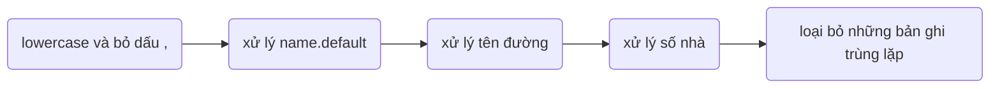

link thư mục tại [AnNT/research](https://drive.google.com/drive/folders/1Tm1KuWKCiTgh9kWwUNXJbiF09Wkrsqb0?usp=sharing)

# Tóm tắt các bước chạy
1. Xử lý dữ liệu cầu giấy
  - cd 1.\ data\ csv
  - python process_caugiay_data.py
  - python check_caugiay_data.py

2. Token dữ liệu từng loại
  - cd 2.\ token\ each\ data
  - python each_db_of_tab.py

3. Tạo dữ liệu huấn luyện
  - git clone https://github.com/datquocnguyen/RDRsegmenter
  - cd 3.\ train\ data
  - python create_data_train_1.py
  - python create_data_train_2.py
  - python create_data_train_3.py
  - python concate_sentence_and_token_sentense.py
  - python create_train_test_data.py
  - Train lại bộ tách từ RDR với các câu tìm kiếm trong dữ liệu huấn luyện

        - cài đặt java 1.8 và python 2.7
        - javac -encoding UTF-8 DataPreprocessor.java
        - java DataPreprocessor train/Train_gold.txt
        - cd train
        - python RDRsegmenter.py train Train_gold.txt.BI Train_gold.txt.RAW.Init
        - lấy file "RDRsegmenter/train/Train_gold.txt.RAW.Init.RDR" đổi tên thành "wordsegmenter.rdr", thay thế cho file "models/wordsegmenter/wordsegmenter.rdr"

  - python create_token_test_data.py để tách câu tìm kiếm của dữ liệu test

4. Lấy char_encode, word_embedd, char_embedd của dữ liệu train, dữ liệu val, dữ liệu test
  - python get_char_to_encode.py
  - python get_tag_embedd.py
  - chạy get_word_embedd_all_data.ipynb trên colab

        mỗi tập dữ liệu train, cần các file 
              - data_no_tag.txt của dữ liệu train, valentine
              - data_no_tag_pred.txt của dữ liệu test

5. Huấn luyện mô hình
  - cd 4.\ train\ model
  - chạy model_all_data.ipynb trên colab

        cần setup link thư mục split data và link lưu model

6. Đánh giá mô hình
  - chạy evaluate_model_with_validate_all_data.ipynb trên colab
  - chạy evaluate_model_with_test_all_data.ipynb trên colab
  - chạy show_result_evaluate_test_data.ipynb trên colab

7. Sử dụng Model thông qua API Flask, Ngrok
  - chạy main_have_char_embedd.ipynb trên colab

# Giải thích chi tiết các bước chạy

    Cài đặt môi trường
    I. Xử lý dữ liệu Cầu Giấy
    II. Token dữ liệu
    III. Tạo dữ liệu huấn luyện
    IV. Lấy char_encode, word_embedd, char_embedd của dữ liệu
    V. Huấn luyện mô hình
    VI. Đánh giá mô hình
    VII. Sử dụng Model thông qua API

## Cài đặt môi trường
### 1. Môi trường sử dụng

    tensorflow 1.15
    keras 2.2.5
    keras-contrib-2.0.8
    python 3.7
    scikit-learn 0.22.2.post1
    matplotlib 3.2.2
    numpy 1.19.5
    flask ngrok 0.0.25
    fasttext 0.9.2
    vncorenlp 1.0.3

### 2. Các file cần cài đặt

  [cc.vi.300.bin](https://dl.fbaipublicfiles.com/fasttext/vectors-crawl/cc.vi.300.bin.gz) là mô hình CBOW Word vectors được xây dựng sẵn của facebook

  [Công cụ tách từ tiếng việt VNcoreNLP](https://github.com/vncorenlp/VnCoreNLP), lấy thư mục models

  [Công cụ tách từ tiếng việt RDR có thể train lại](https://github.com/datquocnguyen/RDRsegmenter), lấy thư mục RDRsegmenter
      
  [char_vocab_VISCII](https://drive.google.com/file/d/17RPRvk6A0i9TPiqdzsaFY0Z-k260e_Kw/view?usp=sharing)
      
  

## I. Xử lý dữ liệu Cầu Giấy
### Thực hiện:

      cd 1. data csv
      python process_caugiay_data.py
      python check_caugiay_data.py

### Kết quả:
    cho ra 2 file gồm:
      ner.txt lưu tên của các đối tượng được đặt tên
      caugiay_processed.json là dữ liệu cầu giấy đã tiền xử lý
### Giải thích:
    python process_caugiay_data.py sẽ xử lý dữ liệu dữ liệu cầu giấy csv
    python check_caugiay_data.py sẽ check file "caugiay_processed.json" vừa xử lý

  > Bước 1: xử lý name.default: chỉ lấy những tên không phải là ghép của số nhà và tên đường
  
  > Bước 2: xử lý tên đường

     - nếu tên đường là số => gán là trống  
     - nếu có chứa số nhà => bỏ đoạn text là số nhà
     - nếu tên đường có chứa ["ward", "xã", "phường", "thị trấn", "quận", "huyện","district","thị xã","thành phố","province","hà nội","việt nam"] thì bỏ từ chỗ bắt đầu đoạn text đến hết

  > Bước 3: xử lý số nhà

    - nếu số nhà không chứa số => gán là trống
    - nếu có dạng "số9", thì sẽ chuyển thành "số 9"
    - nếu có dạng "103-A12", thì sẽ chuyển thành "103 - A12"
    - nếu có chứa ["phố ","đường","duong","ngách","hẻm","ngõ","lô","tổ"], thì sẽ bỏ từ chỗ bắt đầu đoạn text đến hết
  
  > Bước 4: loại bỏ những bản ghi trùng lặp

    Các trường số nhà, đường, xã, huyện, tỉnh, quốc gia của một bản ghi được tách bởi VNcoreNLP, ta được một mảng các từ
    - những từ là số=> <number>
    - từ có dạng 12/13=> <hẻm>
    - từ có dạng 12/13/14=> <ngách>
    - từ có dạng 10000=> <postcode>
    sau đó nối các từ trong mảng thành một câu, dùng các câu này để lọc bản ghi trùng lặp

## II. Token dữ liệu
### Thực hiện:
      cd 2.\ token\ each\ data
      python each_db_of_tab.py
### Kết quả:
      4 file
        obj.txt là obj+feature đã token và đánh tag
        pre.txt là pre đã token và đánh tag
        location.txt là các địa chỉ dữ liệu trong file csv địa chỉ đã đánh tag
        location_ner.txt là location_ner và location_special đã token và đánh tag

## III. Tạo dữ liệu huấn luyện
### Thực hiện:
      git clone https://github.com/datquocnguyen/RDRsegmenter
 
      cd 4.\ train\ data

      python create_data_train_1.py

      python create_data_train_2.py

      python create_data_train_3.py

      python concate_sentence_and_token_sentense.py

      python create_train_test_data.py

      Train lại bộ tách từ RDR với các câu tìm kiếm trong dữ liệu huấn luyện

        - javac -encoding UTF-8 DataPreprocessor.java
        - java DataPreprocessor train/Train_gold.txt
        - cd train
        - python RDRsegmenter.py train Train_gold.txt.BI Train_gold.txt.RAW.Init
        - lấy file "RDRsegmenter/train/Train_gold.txt.RAW.Init.RDR" đổi tên thành "wordsegmenter.rdr", thay thế cho file "models/wordsegmenter/wordsegmenter.rdr"

      python create_token_test_data.py để tách câu tìm kiếm của dữ liệu test
### Kết quả: 
    thư mục all data chứa dữ liệu train chia theo 3 loại câu tìm kiếm

    thư mục split data chứa dữ liệu train, validate, test (tỉ lệ 7:1:2), mỗi thư mục có các file:
      data.txt (dữ liệu huấn luyện gán nhãn đầy đủ)
      data_no_tag.txt (dữ liệu huấn luyện không có nhãn)
      cautruyvan.txt (câu truy vấn của dữ liệu huấn luyện)
      cautruyvan_token.txt (câu truy vấn của dữ liệu huấn luyện đã qua bộ tách từ)

### Giải thích:
    python create_data_train_1.py tạo ra dữ liệu train tạo từ ner
    
    python create_data_train_2.py tạo ra dữ liệu train tạo từ địa chỉ đơn giản
    
    python create_data_train_3.py tạo ra dữ liệu train là địa chỉ đơn giản
    
    python concate_sentence_and_token_sentense.py tạo câu tìm kiếm và câu tìm kiếm token
    
    python create_train_test_data.py 
      - chia 3 dữ liệu train thành những tập dữ liệu nhỏ hơn để train
      - ngoài ra tạo thêm "cautruyvan_token_to_train_RDR.txt", (đưa sẵn vào file "RDRsegmenter/train/Train_gold.txt") là tất cả các câu token của dữ liệu train
    
    Train lại bộ tách từ RDR của VncoreNLP để làm bộ tách từ cho những câu tìm kiếm của bộ test
      Đầu vào là dữ liệu token của bộ train (cautruyvan_token_to_train_RDR.txt), đã được ghép thêm vào file "RDRsegmenter/train/Train_gold.txt"
      Sau khi train xong RDR, lấy file "RDRsegmenter/train/Train_gold.txt.RAW.Init.RDR" đổi tên thành "wordsegmenter.rdr", thay thế cho file "models/wordsegmenter/wordsegmenter.rdr"
    
    python create_token_test_data.py token câu tìm kiếm của dữ liệu test bằng RDR đã train, tạo ra các file "data_no_tag_pred.txt"

## IV.Lấy char_encode, word_embedd, char_embedd của dữ liệu train, dữ liệu val, dữ liệu test
### Thực hiện:
      python get_tag_embedd.py
      python char_to_encode.py
      chạy get_word_embedd_all_data.ipynb trên colab
          - mỗi tập dữ liệu train, cần các file 
              - data_no_tag.txt của dữ liệu train, valentine
              - data_no_tag_pred.txt của dữ liệu test
### Kết quả
    word embedd, char encode, tag embedd của tập dữ liệu train, dữ liệu validate
    word embedd, tag embedd của dữ liệu test

### Chú ý:
* Train bộ tách từ RDR với các câu train để tách các câu tìm kiếm trong bộ test  
* train/cautruyvan_token.txt là dữ liệu train cho mô hình tách từ RDR, được copy vào file Train_gold.txt 
* Chú ý: trong file Train_gold.txt không chứa "_ " hoặc " _" hoặc " _ " vì _ là ký tự nối của 1 từ
* [model tách từ RDR đã train lại theo các câu huấn luyện](https://drive.google.com/file/d/1hiYg2Elg-PbXl81KM4IqZuLJF-x8nR-H/view?usp=sharing), đặt vào trong thư mục models/wordsegmenter của VncoreNLP, và sử dụng với giao diện của VncoreNLP

## V. Huấn luyện mô hình
### Thực hiện
    cd 4.\ train\ model
    Chạy model_all_data.ipynb trên colab
          - cần setup link thư mục split data và link lưu model
### Kết quả
    model đã train xong

## VI. Đánh giá mô hình
### Thực hiện

  - chạy evaluate_model_with_validate_all_data.ipynb trên colab
  - chạy evaluate_model_with_test_all_data.ipynb trên colab
  - chạy show_result_evaluate_test_data.ipynb trên colab

### Kết quả

    Quan sát được độ acc, confused matrix, độ đo P R F1 của các nhãn với dữ liệu validate và dữ liệu test

## VII. Sử dụng Model thông qua API

### Thực hiện
    Chạy main_have_char_embedd.ipynb trên colab
### Kết quả
    API sử dụng models
