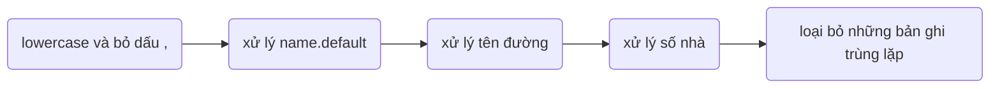

link thư mục tại [AnNT/research](https://drive.google.com/drive/folders/1Tm1KuWKCiTgh9kWwUNXJbiF09Wkrsqb0?usp=sharing)

# I. Cài đặt môi trường
# II. Tạo dữ liệu train model
	1. Xử lý dữ liệu cầu giấy csv
	2. Tách dữ liệu sử dụng VNcoreNLP
	3. Tạo dữ liệu train
# III.Train và đánh giá model
	1. Lấy char_encode, word_embedd, char_embedd từ dữ liệu train
	2. Chia dữ liệu train và test (tỷ lệ 8:2)
	3. Train model
	4. Đánh giá model
# IV. Sử dụng Model thông qua API Flask, Ngrok

* Cần có thư mục models và VnCoreNLP-1.1.1.jar của thư viện tách từ VnCoreNLP
* Train bộ tách từ RDR để xử lý câu tìm kiếm khi đưa vào model để dự đoán (Đã train với các câu huấn luyện hiện có)

# I. Cài đặt môi trường
## 1. Môi trường sử dụng
    tensorflow 1.15
    keras 2.2.5
    keras-contrib-2.0.8
    python 3.7
    scikit-learn 0.22.2.post1
    matplotlib 3.2.2
    numpy 1.19.5
    flask ngrok 0.0.25
    fasttext 0.9.2
    vncorenlp 1.0.3
## 2. Các file cần cài đặt
  [cc.vi.300.bin](https://dl.fbaipublicfiles.com/fasttext/vectors-crawl/cc.vi.300.bin.gz) là mô hình CBOW Word vectors được xây dựng sẵn của facebook

  [Công cụ tách từ tiếng việt VNcoreNLP](https://github.com/vncorenlp/VnCoreNLP)
  
  [char_vocab_VISCII](https://drive.google.com/file/d/17RPRvk6A0i9TPiqdzsaFY0Z-k260e_Kw/view?usp=sharing)
  
  

# II. Tạo dữ liệu train model
## 1. Xử lý dữ liệu cầu giấy csv

### Thực hiện:
  python 1. data csv/process_caugiay_data.py
### Kết quả:
    cho ra 2 file gồm:
      ner.txt lưu tên của các đối tượng được đặt tên
      caugiay_processed.json là dữ liệu cầu giấy đã tiền xử lý
### Giải thích:
    chương trình này sẽ xử lý dữ liệu dữ liệu cầu giấy csv

  > Bước 1: xử lý name.default: chỉ lấy những tên không phải là ghép của số nhà và tên đường
	
  > Bước 2: xử lý tên đường

     - nếu tên đường là số => gán là trống  
     - nếu có chứa số nhà => bỏ đoạn text là số nhà
     - nếu tên đường có chứa ["ward", "xã", "phường", "thị trấn", "quận", "huyện","district","thị xã","thành phố","province","hà nội","việt nam"] thì bỏ từ chỗ bắt đầu đoạn text đến hết

  > Bước 3: xử lý số nhà

    - nếu số nhà không chứa số => gán là trống
    - nếu có dạng "số9", thì sẽ chuyển thành "số 9"
    - nếu có dạng "103-A12", thì sẽ chuyển thành "103 - A12"
    - nếu có chứa ["phố ","đường","duong","ngách","hẻm","ngõ","lô","tổ"], thì sẽ bỏ từ chỗ bắt đầu đoạn text đến hết
	
  > Bước 4: loại bỏ những bản ghi trùng lặp

    sau khi token
    - những word là số=> <number>
    - word có dạng 12/13=> <hẻm>
    - word có dạng 12/13/14=> <ngách>
    - word có dạng 10000=> <postcode>
    sau đó sẽ lọc trùng lặp    

## 	2. Tách dữ liệu sử dụng VNcoreNLP
### Thực hiện:
			python 3. token each data/each_db_of_tab.py
### Kết quả:
			6 file
				obj.txt                 bao gồm obj+feature đã token và đánh tag
				pre.txt                 đã token và đánh tag
				location.txt            bao gồm các địa chỉ dữ liệu trong file csv địa chỉ đã đánh tag
				location_special.txt    đã token và đánh tag
				location_ner.txt        đã token và đánh tag
				location_all.txt        = location.txt + location_special.txt
## 3. Tạo dữ liệu train
### Thực hiện:
			python 4. train data/create_data_train_1.py
			python 4. train data/create_data_train_2.py
			python 4. train data/create_data_train_3.py
### Kết quả:
    6 file:
    > 1_data_train_location_ner_form.txt: 
      câu tìm kiếm gồm đối tượng + pre + đối tượng có tên
    > 2_data_train_location_form.txt: 
      câu tìm kiếm gồm đối tượng + pre + địa chỉ thông thường
    > 3_data_train_location.txt: 
      câu tìm kiếm là địa chỉ đơn giản
---
    dữ liệu train nhưng thiếu tag, dùng để lấy word embedd
    > 1_data_train_no_tag_location_ner_form.txt
    > 2_data_train_no_tag_location_form.txt
    > 3_data_train_no_tag_location.txt
### giải thích:
    chúng ta có 3 tập train theo nội dung của file

# III.Train và đánh giá model
##  1. Lấy char_encode, word_embedd, char_embedd từ dữ liệu train
### Thực hiện:
      python 5. train data to model input/get_tag_embedd.py
      
      python 5. train data to model input/char_to_encode.py

      chạy file get_word_embedd.ipynb trên colab, cần config các thông số:
        link file cc.vi.300.bin là model fasttext lấy word embedd
        3 đường link file tương ứng với data train không có tag
        3 đường link lưu kết quả output
### Kết quả
    word embedd, char encode, tag embedd của 3 tập dữ liệu train
## 2. Chia dữ liệu train và test (tỷ lệ 8:2)
### Thực hiện
    Chạy 6. train model/file split_data_train.ipynb trên colab, cần config các thông số:
        3 đường link là file char_encode, tag_embedd, word_embedd gốc
        3 đường link lưu kết quả char_encode, tag_embedd, word_embedd train
        3 đường link lưu kết quả char_encode, tag_embedd, word_embedd test
### Kết quả:
    Tập dữ liệu train và tập dữ liêu test

## 3. Train model
### Thực hiện
    Chạy 6. train model/model.ipynb trên colab, cần config các thông số:
        3 đường link là file char_encode, tag_embedd, word_embedd train
        1 đường link lưu hình ảnh tổng quan của mô hình
        1 đường link lưu model tốt nhất cho đến quá trình train hiện tại
        1 đường link lưu model đã train xong
### Kết quả
    model đã train xong

## 4. Đánh giá model
### Thực hiện
    Chạy 6. train model/evaluate_model.ipynb trên colab, cần config các thông số:
        1 đường link lưu model đã train
        3 đường link là file char_encode, tag_embedd, word_embedd test

### Kết quả
    Quan sát được độ acc, confused matrix, độ đo P R F1 của các tag

# IV. Sử dụng Model thông qua API flask ngrok
### Thực hiện
    Chạy 6. train model/evaluate_model.ipynb trên colab, cần config các thông số:
        1 đường link lưu model đã train
        link file cc.vi.300.bin là model fasttext lấy word embedd
        link đến file VnCoreNLP-1.1.1.jar, chú ý cần có thư mục models cùng thư mục với file VnCoreNLP-1.1.1.jar
        link file VISCII_short.txt là thư viện char
### Kết quả
    API sử dụng models
  

  