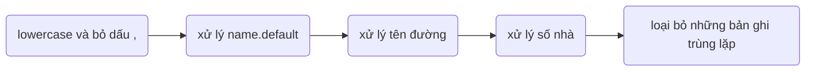

link thư mục tại [AnNT/research](https://drive.google.com/drive/folders/1Tm1KuWKCiTgh9kWwUNXJbiF09Wkrsqb0?usp=sharing)

# Tóm tắt các bước chạy
1. Xử lý dữ liệu cầu giấy
  - cd 1.\ data\ csv
  - python process_caugiay_data.py

2. Token dữ liệu từng loại (token số nhà, token tên đường, các dữ liệu còn lại gán nhãn ngay không cần token)
  - cd 3.\ token\ each\ data
  - python each_db_of_tab.py

3. Tạo dữ liệu huấn luyện
  - cd 4.\ train\ data
  - python create_data_train_1.py
  - python create_data_train_2.py
  - python create_data_train_3.py
  - python concate_sentence.py
  - python create_train_test_data.py

4. Lấy char_encode, word_embedd, char_embedd từ dữ liệu huấn luyện
  - cd 5.\ train\ data\ to\ model\ input
  - python char_to_encode.py
  - python get_tag_embedd.py
  - chạy get_word_embedd.ipynb trên colab

5. Huấn luyện mô hình
  - chạy model.ipynb trên colab

6. Đánh giá mô hình
  - chạy evaluate_model_with_validate_data.ipynb trên colab
  - Train lại bộ tách từ với các câu tìm kiếm trong dữ liệu huấn luyện
      - javac -encoding UTF-8 DataPreprocessor.java
      - java DataPreprocessor train/Train_gold.txt
      - cd train
      - python RDRsegmenter.py train Train_gold.txt.BI Train_gold.txt.RAW.Init
      ***
        sử dụng khi kiểm tra mô hình với dữ liệu test, khi sử dụng mô hình trong thực tế
  - chạy evaluate_model_with_test_data.ipynb trên colab

7. Sử dụng Model thông qua API Flask, Ngrok
  - chạy main_have_char_embedd.ipynb trên colab

# Giải thích chi tiết các bước chạy
# I. Cài đặt môi trường
# II. Tạo dữ liệu train model
	1. Xử lý dữ liệu cầu giấy csv
	2. Tách dữ liệu sử dụng VNcoreNLP
	3. Tạo dữ liệu huấn luyện
# III.Train và đánh giá model
	1. Lấy char_encode, word_embedd, char_embedd từ dữ liệu huấn luyện
	2. Huấn luyện mô hình
	3. Đánh giá mô hình
# IV. Sử dụng Model thông qua API Flask, Ngrok
	1. API

# I. Cài đặt môi trường
## 1. Môi trường sử dụng
    tensorflow 1.15
    keras 2.2.5
    keras-contrib-2.0.8
    python 3.7
    scikit-learn 0.22.2.post1
    matplotlib 3.2.2
    numpy 1.19.5
    flask ngrok 0.0.25
    fasttext 0.9.2
    vncorenlp 1.0.3
## 2. Các file cần cài đặt
  [cc.vi.300.bin](https://dl.fbaipublicfiles.com/fasttext/vectors-crawl/cc.vi.300.bin.gz) là mô hình CBOW Word vectors được xây dựng sẵn của facebook

  [Công cụ tách từ tiếng việt VNcoreNLP](https://github.com/vncorenlp/VnCoreNLP), lấy thư mục models
  
  [char_vocab_VISCII](https://drive.google.com/file/d/17RPRvk6A0i9TPiqdzsaFY0Z-k260e_Kw/view?usp=sharing)
  
  

# II. Tạo dữ liệu train model
## 1. Xử lý dữ liệu cầu giấy csv

### Thực hiện:
  cd 1. data csv
  python process_caugiay_data.py
### Kết quả:
    cho ra 2 file gồm:
      ner.txt lưu tên của các đối tượng được đặt tên
      caugiay_processed.json là dữ liệu cầu giấy đã tiền xử lý
  
### Giải thích:
    chương trình này sẽ xử lý dữ liệu dữ liệu cầu giấy csv

  > Bước 1: xử lý name.default: chỉ lấy những tên không phải là ghép của số nhà và tên đường
	
  > Bước 2: xử lý tên đường

     - nếu tên đường là số => gán là trống  
     - nếu có chứa số nhà => bỏ đoạn text là số nhà
     - nếu tên đường có chứa ["ward", "xã", "phường", "thị trấn", "quận", "huyện","district","thị xã","thành phố","province","hà nội","việt nam"] thì bỏ từ chỗ bắt đầu đoạn text đến hết

  > Bước 3: xử lý số nhà

    - nếu số nhà không chứa số => gán là trống
    - nếu có dạng "số9", thì sẽ chuyển thành "số 9"
    - nếu có dạng "103-A12", thì sẽ chuyển thành "103 - A12"
    - nếu có chứa ["phố ","đường","duong","ngách","hẻm","ngõ","lô","tổ"], thì sẽ bỏ từ chỗ bắt đầu đoạn text đến hết
	
  > Bước 4: loại bỏ những bản ghi trùng lặp
    Các trường số nhà, đường, xã, huyện, tỉnh, quốc gia của một bản ghi được tách bởi VNcoreNLP, ta được một mảng các từ
    - những từ là số=> <number>
    - từ có dạng 12/13=> <hẻm>
    - từ có dạng 12/13/14=> <ngách>
    - từ có dạng 10000=> <postcode>
    sau đó nối các từ trong mảng thành một câu, dùng các câu này để lọc bản ghi trùng lặp
## 	2. Tách dữ liệu sử dụng VNcoreNLP
### Thực hiện:
      cd 3. token each data
			python each_db_of_tab.py
### Kết quả:
			6 file
				obj.txt                 bao gồm obj+feature đã token và đánh tag
				pre.txt                 đã token và đánh tag
				location.txt            bao gồm các địa chỉ dữ liệu trong file csv địa chỉ đã đánh tag
				location_special.txt    đã token và đánh tag
				location_ner.txt        đã token và đánh tag
				location_all.txt        = location.txt + location_special.txt
## 3. Tạo dữ liệu huấn luyện
### Thực hiện:
			cd 4.\ train\ data
			python create_data_train_1.py
			python create_data_train_2.py
			python create_data_train_3.py
			python concate_sentence.py
			python create_train_test_data.py
### Kết quả: 
    thư mục chứa dữ liệu train, validate, test (tỉ lệ 7:1:2), mỗi thư mục có các file:
      data.txt (dữ liệu huấn luyện gán nhãn đầy đủ)
      data_no_tag.txt (dữ liệu huấn luyện không có nhãn)
      cautruyvan.txt (câu truy vấn của dữ liệu huấn luyện)
      cautruyvan_token.txt (câu truy vấn của dữ liệu huấn luyện đã qua bộ tách từ)

# III.Train và đánh giá model
##  1. Lấy char_encode, word_embedd, char_embedd từ dữ liệu huấn luyện
### Thực hiện:
      cd 5. train data to model input
      python get_tag_embedd.py
      
      python char_to_encode.py

      chạy file get_word_embedd.ipynb trên colab, cần config các thông số:
        link file cc.vi.300.bin là model fasttext lấy word embedd
        2 đường link file tương ứng với dữ liệu train, dữ liệu validate không có tag
        2 đường link lưu kết quả output
### Kết quả
    word embedd, char encode, tag embedd của tập dữ liệu train, dữ liệu validate
## 3. Huấn luyện mô hình
### Thực hiện
    Chạy 6. train model/model.ipynb trên colab, cần config các thông số:
        3 đường link là file char_encode, tag_embedd, word_embedd train
        1 đường link lưu hình ảnh tổng quan của mô hình
        1 đường link lưu model đã train xong
### Kết quả
    model đã train xong

## 4. Đánh giá mô hình
### Thực hiện
  - chạy evaluate_model_with_validate_data.ipynb trên colab
  - Train lại bộ tách từ với các câu tìm kiếm trong dữ liệu huấn luyện
      - javac -encoding UTF-8 DataPreprocessor.java
      - java DataPreprocessor train/Train_gold.txt
      - cd train
      - python RDRsegmenter.py train Train_gold.txt.BI Train_gold.txt.RAW.Init
      ***
        sử dụng khi kiểm tra mô hình với dữ liệu test, khi sử dụng mô hình trong thực tế
  - python token_test_data.py để tách câu tìm kiếm của dữ liệu test
  - chạy get_word_embedd.ipynb trên colab được word_embedd của dữ liệu test
  - chạy evaluate_model_with_test_data.ipynb trên colab

### Kết quả
    Quan sát được độ acc, confused matrix, độ đo P R F1 của các nhãn với dữ liệu validate và dữ liệu test
### Chú ý:
* Train bộ tách từ RDR để tách câu tìm kiếm khi đưa vào model để dự đoán (Đã train với các câu huấn luyện hiện có)
* cautruyvan_token.txt là dữ liệu train cho mô hình tách từ RDR, được copy vào file Train_gold.txt 
* Chú ý: trong file Train_gold.txt không chứa "_ " hoặc " _" hoặc " _ " vì _ là ký tự nối của 1 từ
* [model tách từ RDR đã train lại theo các câu huấn luyện](https://drive.google.com/file/d/1hiYg2Elg-PbXl81KM4IqZuLJF-x8nR-H/view?usp=sharing), đặt vào trong thư mục models/wordsegmenter của VncoreNLP, và sử dụng với giao diện của VncoreNLP

# IV. Sử dụng Model thông qua API flask ngrok
## 1. API
### Thực hiện
    Chạy 6. train model/evaluate_model.ipynb trên colab, cần config các thông số:
        1 đường link lưu model đã train
        link file cc.vi.300.bin là model fasttext lấy word embedd
        link đến file VnCoreNLP-1.1.1.jar, chú ý cần có thư mục models cùng thư mục với file VnCoreNLP-1.1.1.jar
        link file VISCII_short.txt là thư viện char
### Kết quả
    API sử dụng models
  

  